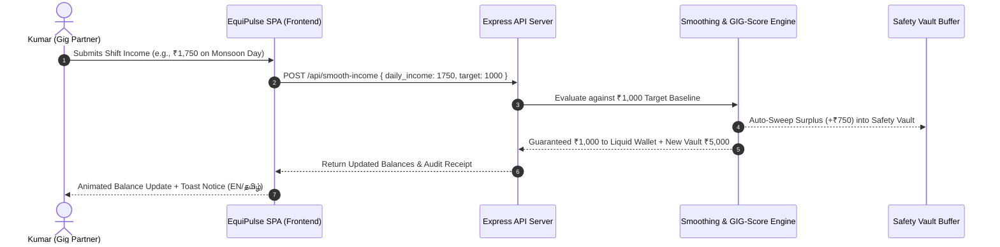

# ⚡ EquiPulse (சமநிலை)
### Autonomous Financial Resilience Engine for Gig and Informal Workers
**Hackathon Problem Statement 4: Financial Resilience for Gig & Informal Workers**

[](https://nodejs.org/)
[](https://tailwindcss.com/)
[](LICENSE)
[](#bilingual-accessibility)
[](#shift-backed-micro-advance)

---

## 📌 1. The Core Problem: The Gig Economy Volatility Trap

India’s gig economy engages over **12 million informal workers**—delivery partners on Swiggy and Zomato, ride-hail captains on Uber and Ola, and urban service workers. Despite their hard work, they face structural financial fragility:

1. **The "Feast or Famine" Income Rollercoaster:**
   Earnings are erratic. On rainy surge days or festive weekends, a worker in Chennai might make **₹1,800/day**; but on a slow Monday or during a vehicle breakdown, earnings plummet to **₹300/day**, which fails to even cover fuel and meal costs.
2. **Predatory Loan Traps:**
   Informal workers have no formal pay stubs, PF accounts, or tax returns. When unexpected emergencies strike, traditional banks deny them credit, forcing them into the hands of illegal payday loan apps charging 60%–300% annualized interest with aggressive recovery harassment.
3. **Absence of Buffer Discipline:**
   Surplus earnings during peak days are often immediately spent rather than preserved, leaving zero liquidity when the next lull hits.

---

## 💡 2. The EquiPulse Solution

**EquiPulse** transforms irregular daily gig cash flows into a predictable, dignified salary experience:

```
+-----------------------------------------------------------------------------------+
|                            E Q U I P U L S E   E N G I N E                        |
+-----------------------------------------------------------------------------------+
       |                                                               |
       v                                                               v
 [1. AI Income Smoother]                                     [2. GIG-Score Engine]
   • High Day (> ₹1,000):                                      • Active Hours Consistency (35%)
     Auto-sweeps surplus to Safety Vault                       • Platform Customer Rating (35%)
   • Lean Day (< ₹1,000):                                      • 30-Day Income Stability  (30%)
     Auto-disburses buffer to spending wallet                  => Replaces CIBIL / FICO
       |                                                               |
       +-------------------------------+-------------------------------+
                                       |
                                       v
                     [3. Shift-Backed Micro-Advance]
                       • Instant 1-Click Liquidity (₹1k - ₹15k)
                       • 0% APR Predatory-Free Loan
                       • Repaid via 4 auto micro-deductions from shifts
```

### Key Architectural Pillars:

* **Autonomous AI Income Smoother & Safety Vault:**
  Sets an optimal living baseline (e.g., ₹1,000/day). Whenever daily earnings exceed this target, the surplus is swept into a high-security emergency buffer. On slow or breakdown days, the shortfall is automatically injected into the worker’s liquid wallet.
* **Work-Based GIG-Score (300–800):**
  A dynamic alternative credit rating algorithm that evaluates gig effort:
  * **35% Active Hours Consistency:** Reward for shift reliability and punctuality.
  * **35% Platform Customer Rating:** High customer satisfaction indicates professional conduct.
  * **30% Income Regularity:** 30-day stability score measuring baseline predictability.
* **Shift-Backed Micro-Advance:**
  Pre-approved emergency micro-credit with **0% predatory interest**, repaid transparently through 4 scheduled fractional deductions from upcoming platform shift settlements.
* **Hyperlocal Monsoon & Surge Radar:**
  Predictive intelligence tailored for Chennai (OMR, Velachery, T. Nagar). Alerts workers ahead of heavy rainfalls to work optimal 5-hour peak surge windows and bank surplus funds into their Safety Vault.
* **Bilingual Tamil & English Interface:**
  Inclusive, vernacular-first UI allowing gig workers to seamlessly toggle between English and தமிழ்.

---

## 🏛️ 3. Architecture & Data Flow



---

## 📡 4. Comprehensive API Specifications

| Method | Endpoint | Description | Request Body Example | Response Highlights |
| :--- | :--- | :--- | :--- | :--- |
| `GET` | `/api/dashboard-data` | Fetches 30-day records, vault balance, liquid wallet, active GIG-Score, and surge alerts | None | `{ success, worker, target_baseline, main_balance, vault_balance, gig_score_details, history, smoothed_comparison }` |
| `POST` | `/api/smooth-income` | Executes autonomous sweep (> baseline) or disbursement (< baseline) | `{ "daily_income": 1650, "target_baseline": 1000 }` | `{ success, action, swept_amount, disbursed_amount, main_balance, vault_balance, transaction }` |
| `POST` | `/api/calculate-gigscore`| Recalculates work-based credit score (300 - 800) and risk tier | `{ "data": [...] }` (optional) | `{ gig_score: 738, risk_category: "Prime Partner", max_eligible_credit: 15000, breakdown: {...} }` |
| `POST` | `/api/request-advance` | Approves and disburses shift-backed micro-advance to liquid wallet with repayment schedule | `{ "requested_amount": 2000 }` | `{ success, new_main_balance, advance: { id, installments: 4, per_shift_deduction: 500, repayment_schedule } }` |
| `GET` | `/api/weather-surge` | Real-time Chennai monsoon and zone demand radar | None | `{ success, zones: [...], northeast_monsoon_warning: true }` |
| `POST` | `/api/reset-demo` | Resets all balances and states to clean initial demo values | None | `{ success: true, message: "Demo state reset" }` |

---

## 💻 5. Technology Stack

* **Backend:**
  * **Runtime:** Node.js (v18+)
  * **Framework:** Express.js (v4.19+)
  * **Middleware:** CORS, JSON Body Parsing, Native Static File Serving
* **Frontend:**
  * **Architecture:** Vanilla Single-Page Application (SPA) - Zero heavy build steps required
  * **Styling:** Tailwind CSS (CDN) with modern dark glassmorphism (`#0b0f19` dark canvas, blurred overlays, glowing borders)
  * **Visualizations:** Chart.js (Dual-dataset time-series comparing volatile vs. smoothed income lines)
  * **Icons & Typography:** FontAwesome 6, Google Plus Jakarta Sans, Google Noto Sans Tamil
  * **Localization:** Native client-side bilingual engine supporting instant English and தமிழ் toggle
* **Data Layer:**
  * 30-day granular time-series JSON database modeling real-world gig shifts in Chennai (active hours, deliveries, platform rating, weather events, daily expenses).

---

## 📂 6. Directory Structure

```
EquiPulse/
├── backend/
│   ├── data.json           # 30-day realistic time-series dataset for Chennai gig worker
│   ├── package.json        # Express & CORS dependencies
│   └── server.js           # API engine, income smoother, GIG-score logic & static server
├── frontend/
│   └── index.html          # Dark-themed bilingual Fintech SPA (Tailwind + Chart.js + Vanilla JS)
└── README.md               # Complete architecture & documentation
```

---

## 🚀 7. Quickstart & Setup Instructions

### Prerequisites
* Node.js (v18 or higher) and npm installed.

### Step 1: Install Dependencies
Open your terminal and navigate to the `backend` directory:
```bash
cd backend
npm install
```

### Step 2: Launch the EquiPulse Server
```bash
node server.js
```
The server will start on port `5000`:
```
==================================================
⚡ EquiPulse Backend running on http://localhost:5000
⚡ Frontend served at http://localhost:5000/
==================================================
```

### Step 3: Open the Dashboard
Open your web browser and navigate to:
**[http://localhost:5000](http://localhost:5000)**

*(Alternatively, you can open `frontend/index.html` directly in any web browser thanks to full CORS enablement on the API).*

---

## 👤 8. Persona Case Study: Kumaravel S. (குமார்)

* **Age:** 31 | **Location:** T. Nagar / Velachery, Chennai
* **Platforms:** Swiggy Super-Partner (Food & Instamart) & Uber Premier Auto
* **Daily Target Baseline:** ₹1,000
* **Day-in-the-Life with EquiPulse:**
  1. **Monsoon Friday (Surge Day):** Kumar works 11.5 hours in heavy rain and earns **₹1,750**. EquiPulse leaves **₹1,000** in his spending wallet and auto-sweeps **₹750** into his Safety Vault.
  2. **Monday Slump:** Demand is low and his tire suffers a puncture, resulting in only **₹350** earned. EquiPulse detects the ₹650 deficit and immediately disburses **₹650** from his Safety Vault. Kumar still goes home with his guaranteed **₹1,000** living baseline.
  3. **Emergency Expense:** When Kumar needs ₹2,000 for unexpected vehicle repairs, his **738 GIG-Score** grants him an instant 1-click advance with **0% interest**, automatically recovered in 4 small deductions of ₹500 across his upcoming shifts.

---

## 📄 License
This project is licensed under the MIT License - built for hackathon innovation in financial inclusion and informal worker resilience.
